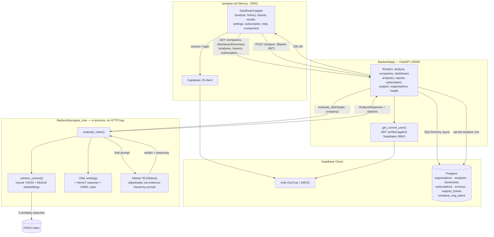
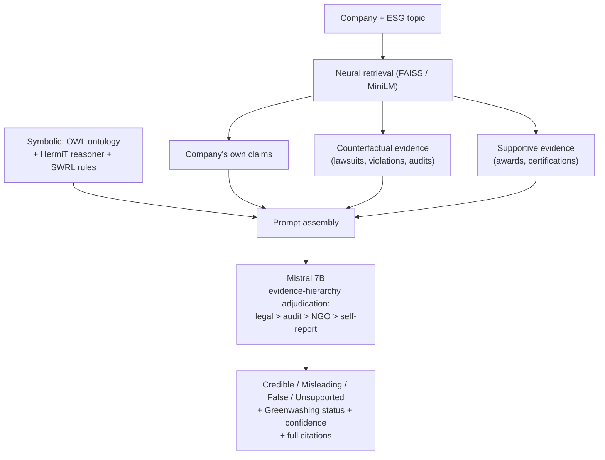

# SYNAPSE — Evidence-Grounded ESG Greenwashing Detection

SYNAPSE is an enterprise web application that evaluates a company's ESG
(Environmental, Social, Governance) claims and flags likely **greenwashing** —
sustainability marketing that outpaces the evidence behind it. Given a
company and an ESG topic (e.g. "Sustainable Production", "Business Ethics"),
it retrieves the company's own disclosures alongside independent evidence
that would *support* or *contradict* the claim, reasons over both using a
symbolic ontology of greenwashing patterns, and returns a verdict
(`Credible` / `Misleading` / `False` / `Unsupported`) with full citations —
never a black-box score.

The project has two parts:

- **`Backend/`** — a FastAPI service. Its core is **`synapse_core/`**, the
  novel piece of this work (see below): a **neurosymbolic, counterfactual
  reasoning pipeline** that is the actual research contribution, wrapped in
  a conventional CRUD API (`app/`) for auth, organizations, saved analyses,
  billing, and support.
- **`synapse-ud/`** — the Next.js frontend enterprise users interact with.

> Everything under `Backend/` (outside `synapse_core/`) and `synapse-ud/`
> is standard SaaS scaffolding. `Backend/synapse_core/` is where the actual
> greenwashing-detection method lives.

---

## Getting Started

**Prerequisites:** Python 3.11, Node 20+, a running [Ollama](https://ollama.com)
instance with `mistral:7b` pulled, and a Supabase project (Postgres + Auth).

```bash
# 1. Backend
cd Backend
source venv/bin/activate        # or: python -m venv venv && pip install -r requirements.txt
python -m app.db.migrate        # one-time / re-runnable schema setup
uvicorn app.main:app --reload   # http://localhost:8000

# 2. Frontend (separate shell)
cd synapse-ud
npm install
npm run dev                     # http://localhost:3000
```

Environment files expected: `Backend/.env` (`SUPABASE_URL`,
`SUPABASE_SECRET_KEY`, `SUPABASE_DB_URL`, `CORS_ORIGINS`) and
`synapse-ud/.env.local` (`NEXT_PUBLIC_SUPABASE_URL`,
`NEXT_PUBLIC_SUPABASE_ANON_KEY`, `NEXT_PUBLIC_API_URL`).

---

## Folder Structure

```
w1867150_FPC/
├── Backend/
│   ├── app/                        # Conventional SaaS API — auth, CRUD, billing
│   │   ├── main.py                 # FastAPI app, mounts every router
│   │   ├── core/
│   │   │   ├── config.py           # pydantic-settings, reads Backend/.env
│   │   │   └── security.py         # Supabase JWT verification (get_current_user)
│   │   ├── db/
│   │   │   ├── base.py             # SQLAlchemy declarative Base
│   │   │   ├── session.py          # async engine + get_db dependency
│   │   │   ├── supabase_admin.py   # service-role client (bypasses RLS)
│   │   │   └── migrate.py          # re-runnable schema setup script
│   │   ├── deps.py                 # shared deps (get_current_org)
│   │   ├── models/                 # SQLAlchemy ORM tables
│   │   │   ├── organization.py, analysis_record.py, bookmark.py,
│   │   │   │   subscription.py, support_ticket.py, esg_topic.py
│   │   │   └── analysis.py         # Pydantic AnalyzeRequest/AnalyzeResponse
│   │   ├── schemas/                # Pydantic request/response models
│   │   └── routers/                # health, organizations, analyze, companies,
│   │                                 dashboard, analyses, reports, subscription, support
│   ├── synapse_core/                ★ THE NOVELTY — see next section
│   │   ├── pipeline.py             # evaluate_claim() orchestrator
│   │   ├── retrieval.py            # neural retrieval: company / counterfactual / supportive
│   │   ├── ontologyInfo.py         # symbolic reasoning over the OWL ontology
│   │   ├── prompt.py               # evidence-hierarchy prompt + few-shot examples
│   │   ├── llm.py                  # Ollama (Mistral 7B) client
│   │   └── build_vectorstore.py    # one-off FAISS index builder
│   ├── DataPreprocessing/          # ESG dataset cleaning, topic extraction, DB loader
│   ├── faiss_index/                # pre-built vector store (169k ESG document chunks)
│   ├── ontology.owl                # OWL greenwashing ontology
│   └── requirements.txt
│
└── synapse-ud/
    ├── app/
    │   ├── page.tsx                # marketing homepage
    │   ├── login/, signup/, pending/, checkout/
    │   └── dashboard/              # authenticated app (see Frontend section)
    │       ├── layout.tsx          # auth + org-verification gate
    │       ├── analyze/, companies/, history/, reports/, results/,
    │       │   settings/, subscription/, help/
    ├── components/
    │   ├── dashboard/, marketing/, auth/, ui/
    └── lib/
        ├── api.ts                  # typed fetch layer for every backend endpoint
        ├── dashboard-data.ts       # Verdict types + judgment/status → Verdict mappers
        ├── org-context.tsx         # signed-in org/user React context
        └── supabase/               # browser + server Supabase clients
```

---

## Architecture



`POST /analyze`'s actual reasoning never touches Postgres — it reads a local
FAISS index and a local OWL file and calls a locally-hosted LLM. Postgres
only stores *reference data* (which companies/topics exist) and *user
data* (saved analyses, org, billing) — the detection method itself has no
database dependency.

---

## `synapse_core` — the novelty: neurosymbolic, counterfactual-reasoning detection

This is the actual research contribution. Two ideas distinguish it from a
standard "RAG + LLM verdict" pipeline:

### 1. Neurosymbolic — neural retrieval fused with symbolic reasoning

The system doesn't just embed documents and let the LLM freely associate.
Two genuinely different reasoning modes are combined at the prompt level:

- **Neural**: `retrieval.py` embeds the company's claim with
  `sentence-transformers/all-MiniLM-L6-v2` and runs cosine-similarity search
  over a 169k-chunk FAISS index built from ESG disclosures, regulatory
  filings, and news coverage (`build_vectorstore.py`).
- **Symbolic**: `ontologyInfo.py` loads a hand-authored **OWL ontology**
  (`ontology.owl`) of greenwashing concepts and relationships, runs the
  **HermiT reasoner** (`sync_reasoner_hermit`) to materialize inferred class
  memberships and **SWRL rules**, and serializes the resulting class
  hierarchy, object properties, and logical statements into the prompt
  alongside the retrieved documents.

The LLM is instructed (`prompt.py`) to select the most applicable ontology
object property and ground its judgment in it — the symbolic layer
constrains *how* the neural evidence can be interpreted, rather than the LLM
reasoning over raw text alone.

### 2. Counterfactual reasoning — actively searching for disconfirming evidence

Standard RAG retrieves whatever's most similar to the query and treats it as
support. `retrieve_context()` instead runs **three separate, purpose-built
retrievals** per claim:

| Query type | What it searches for | Purpose |
|---|---|---|
| Company reports | The company's own sustainability/annual reports | The **claim being tested**, not evidence for it |
| **Counterfactual** | `"...allegations fraud misleading contradicts... lawsuit investigation regulatory violation independent audit..."` | Evidence that would **falsify** the claim |
| Supportive | `"...commitment excellence... award praised... third-party validation..."` | Evidence that would **corroborate** the claim |

This is a deliberately falsificationist design: the system goes looking for
the strongest available case *against* the company's claim before it looks
for a case for it. `prompt.py`'s adjudication rules make this explicit —
counter-evidence is weighted according to a strict hierarchy:

```
STRONGEST  Legal actions, regulatory violations, government investigations
STRONG     Independent audits contradicting claims, investigative journalism
MODERATE   Industry criticism, NGO reports
WEAK       The company's own statements (never counted as evidence for itself)
```

and "if ANY credible counter-evidence exists, it MUST heavily influence the
judgment" — the company's own disclosures can only ever be the *claim under
test*, never evidence in their own favor. The final verdict
(`Credible | Misleading | False | Unsupported`, plus a binary
`Greenwashing | NotGreenwashing` status and a 0.0–1.0 confidence) is only
`Credible` when counter-evidence was actively sought and not found.



---

## API Documentation

Base URL: `NEXT_PUBLIC_API_URL` (`http://localhost:8000` in dev). Auth is a
Supabase JWT as `Authorization: Bearer <token>`, verified in
`app/core/security.py`. 🔒 = auth required.

| Method | Endpoint | 🔒 | Request model | Response model |
|---|---|---|---|---|
| GET | `/health` | | — | `{"status": "ok"}` |
| POST | `/organizations` | | `OrganizationCreate {user_id, name, tin}` | `OrganizationOut` (201) |
| GET | `/organizations/me?user_id=` | | — | `OrganizationOut` |
| PATCH | `/organizations/{org_id}` | 🔒 | `OrganizationUpdate {name?}` | `OrganizationOut` |
| GET | `/organizations/{org_id}/notifications` | 🔒 | — | `NotificationPreferences` |
| PUT | `/organizations/{org_id}/notifications` | 🔒 | `NotificationPreferences` | `NotificationPreferences` |
| DELETE | `/organizations/{org_id}` | 🔒 | — | 204 (soft delete) |
| GET | `/companies` | | — | `list[CompanyOptions]` |
| POST | `/analyze` | 🔒 | `AnalyzeRequest {company, topic}` | `AnalyzeResponse` |
| GET | `/dashboard/summary` | 🔒 | — | `DashboardSummary` |
| GET | `/analyses?search=&company=&verdict=&sort=&page=&page_size=` | 🔒 | — | `AnalysisListResponse` |
| GET | `/analyses/by-query?company=&topic=` | 🔒 | — | `AnalysisDetail` |
| GET | `/analyses/{id}` | 🔒 | — | `AnalysisDetail` |
| DELETE | `/analyses/{id}` | 🔒 | — | 204 |
| POST | `/analyses/{id}/bookmark` | 🔒 | — | `{"bookmarked": true}` (201, idempotent) |
| DELETE | `/analyses/{id}/bookmark` | 🔒 | — | 204 |
| GET | `/analyses/{id}/download` | 🔒 | — | HTML file attachment |
| POST | `/analyses/{id}/share` | 🔒 | — | `ShareResponse {share_url, expires_at}` |
| GET | `/reports?search=` | 🔒 | — | `AnalysisListResponse` (bookmarked only) |
| GET | `/subscription` | 🔒 | — | `SubscriptionOut` |
| GET | `/subscription/invoices` | 🔒 | — | `list[InvoiceOut]` |
| GET | `/subscription/invoices/{id}/download` | 🔒 | — | HTML file attachment |
| POST | `/checkout` | 🔒 | `CheckoutRequest {plan}` | `CheckoutResponse` (201) |
| POST | `/subscription/upgrade` | 🔒 | `CheckoutRequest {plan}` | `CheckoutResponse` |
| POST | `/subscription/cancel` | 🔒 | — | `CheckoutResponse` |
| POST | `/support/tickets` | optional | `SupportTicketCreate {email, subject, message}` | `SupportTicketOut` (201) |

### Key schemas

```ts
AnalyzeResponse {
  company_claim_summary: string | null
  object_property: string | null        // ontology property the verdict is grounded in
  judgment: "Credible" | "False" | "Misleading" | "Unsupported" | null
  greenwashing_status: "Greenwashing" | "NotGreenwashing" | null
  confidence: number | null             // 0.0–1.0, from the LLM or a judgment-based fallback
  reason_for_judgement: string[]        // counterfactual-first reasoning steps, quotes cited
  summary_support_evidence: string | null
  summary_counter_evidence: string | null
  retrieved_documents: {
    company_reports: Citation[]
    counterfactual_sources: Citation[]  // the falsification search results
    supportive_sources: Citation[]
  }
  error: string | null                  // set instead of the above if LLM output wasn't valid JSON
  raw_content: string | null
}

Citation { source: string | null; content: string | null; score: number | null; metadata: object | null }

CompanyOptions { name: string; topics: string[]; ticker: string | null; industry: string | null }
// ticker/industry are always null today — source dataset has no such columns.

AnalysisListItem { id, company, topic, judgment, confidence, created_at, bookmarked }
AnalysisDetail    { ...AnalyzeResponse fields, id, company, topic, confidence, created_at,
                    bookmarked, key_findings: string[], recommendation: string | null }
DashboardSummary  { analyses_count, companies_analyzed_count, saved_reports_count,
                    avg_confidence, recent_analyses: RecentAnalysis[] }
SubscriptionOut   { plan, status, renewal_date, usage: { analyses_used, analyses_limit,
                    queries_remaining, reports_saved } }
```

Billing is fully simulated (no Stripe integration — `POST /checkout` never
accepts raw card data). Downloads are self-contained HTML today, not PDF —
no PDF library is wired up yet.

---

## Frontend — Pages & Features

All `/dashboard/*` pages are gated by `app/dashboard/layout.tsx`: redirects
to `/login` without a session, `/signup` without an org, `/pending` while
the org is unverified.

| URL | Live data | Features |
|---|---|---|
| `/` | static | Marketing homepage — hero, services, pricing, FAQ |
| `/login` | Supabase Auth | Email/password sign-in |
| `/signup` | Supabase Auth + `POST /organizations` | Account + org creation, TIN verification submission |
| `/pending` | static | Org-verification holding screen |
| `/checkout` | `POST /checkout` | Plan summary + billing form (simulated — no real charge), plan persisted server-side |
| `/dashboard` | `GET /dashboard/summary`, `/subscription` | Usage stat cards, monthly usage bar, recent-analyses table |
| `/dashboard/analyze` | `GET /companies`, `POST /analyze` | Company/topic pickers, live greenwashing verdict with full evidence citations |
| `/dashboard/companies` | `GET /companies` | Searchable directory of all tracked companies + their ESG topics |
| `/dashboard/history` | `GET /analyses` | Search, company/judgment filters, pagination, view/download/bookmark/delete per row |
| `/dashboard/reports` | `GET /reports` | Bookmarked analyses grid, unbookmark, download |
| `/dashboard/results` | `GET /analyses/by-query` | Full report: verdict, key findings, evidence-hierarchy reasoning, tabbed evidence panel, save/download/share |
| `/dashboard/settings` | `PATCH/DELETE /organizations`, notifications GET/PUT | Org name edit, notification toggles, danger-zone org deletion |
| `/dashboard/subscription` | `GET /subscription`, `/subscription/invoices` | Plan/usage/renewal, upgrade/cancel, billing history + invoice download |
| `/dashboard/help` | `POST /support/tickets` | FAQ accordion, support ticket submission |
